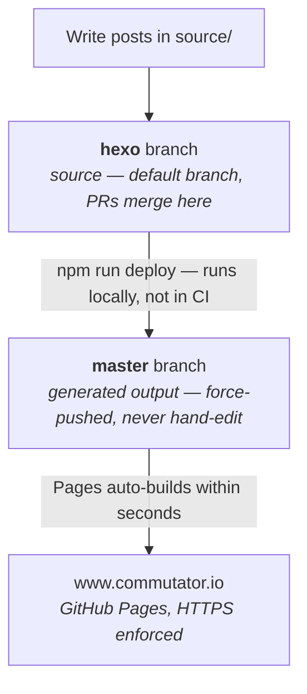

# Daily microblogging

Personal microblogging project.

## Concept of the blog

The concept would be to write a short post every day that is easy to read.

Every post must emphasize a great idea related to lifestyle and entrepreneurship. It keeps ideas I encounter over time organized and searchable if I need it later.

The layout has to be very simple, most of the time with text only or video only content.

The goal of writing blog posts everyday is to setup a habit of writing and improving my writing skills with time.

Examples of blog that have great style:
- Coding horror - https://blog.codinghorror.com
- This made my day - Discontinued
- Zen Habits - https://zenhabits.net
- Scott Hanselman - https://www.hanselman.com/blog/
- Better explained - https://betterexplained.com

## How this repo is laid out

The two branches have inverted roles from what the names suggest. `hexo` is the
default branch and holds the source. `master` holds the generated site and is
force-pushed by the deploy step, so it must never be edited by hand — anything
committed there directly is wiped by the next deploy.



Publishing is automatic, generation is not. There is no CI: nothing watches the
`hexo` branch, so merging a pull request does not change the live site. The site
only updates when `npm run deploy` is run locally, which regenerates `public/`
and force-pushes it to `master`. GitHub Pages then rebuilds on its own.

## Using the source code

Requires Node >= 20.19.0 (Hexo 8).

```
npm ci              # install pinned dependencies
npx hexo server     # preview at http://localhost:4000
npm run deploy      # generate and publish to master
```

Two things worth knowing before deploying:

- `source/CNAME` carries the custom domain. It has to stay in `source/` so Hexo
  copies it into `public/` on every build — the deploy force-pushes only what is
  in `public/`, so a `CNAME` living anywhere else gets dropped and the custom
  domain breaks.
- Hexo 7 removed the built-in `youtube` and `vimeo` tags that posts here rely on.
  They are reimplemented in `themes/minos/scripts/video-tags.js` rather than
  pulled in as a dependency.
