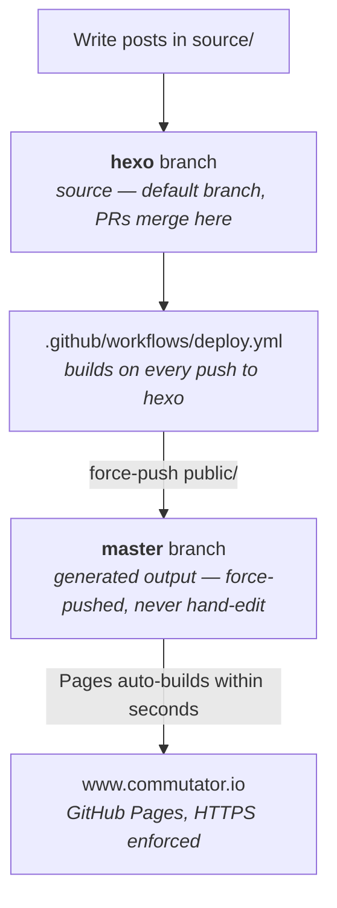

# Daily microblogging

Personal microblogging project.

## Concept of the blog

The concept would be to write a short post every day that is easy to read.

Every post must emphasize a great idea related to lifestyle and entrepreneurship. It keeps ideas I encounter over time organized and searchable if I need it later.

The layout has to be very simple, most of the time with text only or video only content.

The goal of writing blog posts everyday is to setup a habit of writing and improving my writing skills with time.

Examples of blog that have great style:
- Coding horror - https://blog.codinghorror.com
- This made my day - Discontinued
- Zen Habits - https://zenhabits.net
- Scott Hanselman - https://www.hanselman.com/blog/
- Better explained - https://betterexplained.com

## How this repo is laid out

The two branches have inverted roles from what the names suggest. `hexo` is the
default branch and holds the source. `master` holds the generated site and is
force-pushed by the deploy step, so it must never be edited by hand — anything
committed there directly is wiped by the next deploy.



The whole chain is automatic: pushing or merging to `hexo` builds the site and
publishes it, with no local step. Pull requests run the same build without
publishing, so breakage shows up before it reaches the live site.

`npm run deploy` still works from a laptop and does exactly the same thing, but
it is only a fallback now — prefer letting CI publish, so what is live always
matches what is on `hexo`.

## Using the source code

Requires Node >= 20.19.0 (Hexo 8).

```
npm ci              # install pinned dependencies
npx hexo server     # preview at http://localhost:4000
npm run deploy      # fallback: generate and publish by hand
```

Two things worth knowing:

- `source/CNAME` carries the custom domain. It has to stay in `source/` so Hexo
  copies it into `public/` on every build — publishing replaces `master` with
  only what is in `public/`, so a `CNAME` living anywhere else gets dropped and
  the custom domain breaks. CI fails the build if it goes missing.
- Hexo 7 removed the built-in `youtube` and `vimeo` tags that posts here rely on.
  They are reimplemented in `themes/minos/scripts/video-tags.js` rather than
  pulled in as a dependency.
